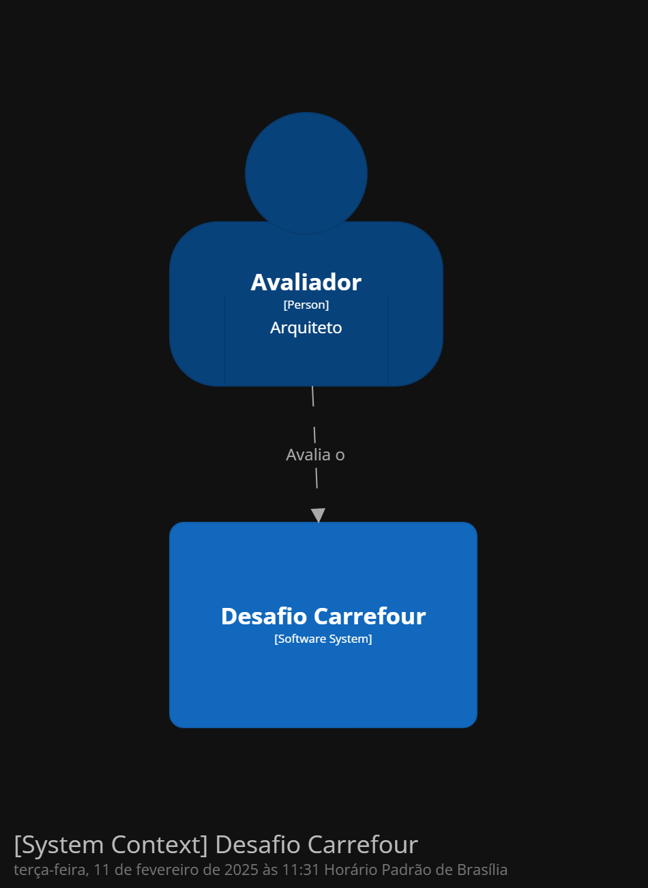
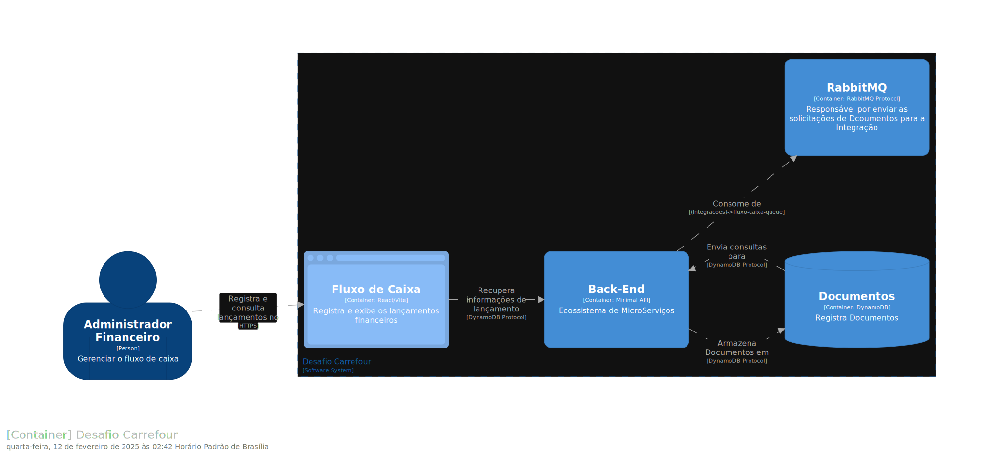
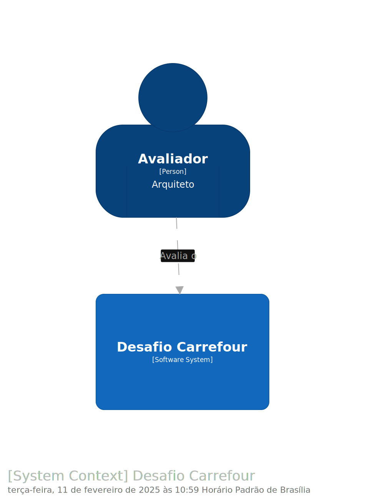
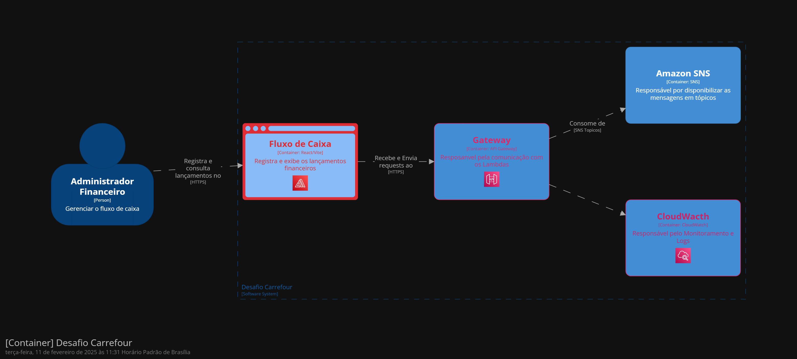
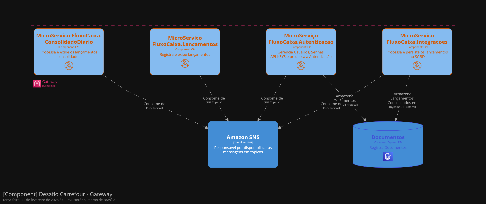
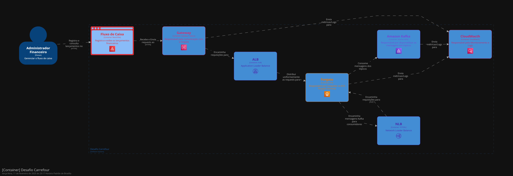
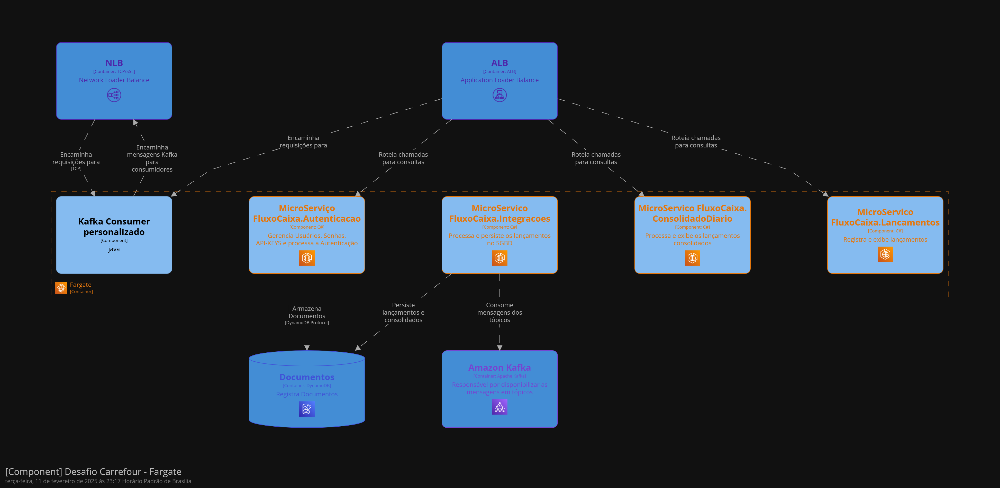

# Documentação da Arquitetura - Fluxo de Caixa

## Índice
1. [Introdução](#introdução)
2. [Visão Geral da Arquitetura](#visão-geral-da-arquitetura)
3. [Decisões Arquiteturais](#decisões-arquiteturais)
   - [Escolha da AWS como Plataforma Cloud](#1️⃣-escolha-da-aws-como-plataforma-cloud)
   - [Uso de AWS Lambda na Arquitetura Base](#2️⃣-uso-de-aws-lambda-na-arquitetura-base)
   - [Migração para ECS Fargate na Arquitetura Final](#3️⃣-migração-para-ecs-fargate-na-arquitetura-final)
   - [Adoção de SNS/SQS na Arquitetura Base](#4️⃣-adoção-de-sns-sqs-na-arquitetura-base)
   - [Substituição de SNS/SQS por Kafka MSK na Arquitetura Final](#5️⃣-substituição-de-sns-sqs-por-kafka-msk-na-arquitetura-final)
   - [Implementação do CQRS](#6️⃣-implementação-do-cqrs)
   - [Utilização de DynamoDB para Persistência](#7️⃣-utilização-de-dynamodb-para-persistência)
   - [Uso de API Gateway](#8️⃣-uso-de-api-gateway)
   - [Implementação de Autenticação via JWT](#9️⃣-implementação-de-autenticação-via-jwt)
   - [Segurança e Monitoramento](#🔟-segurança-e-monitoramento)
4. [Arquiteturas Evolutivas](#arquiteturas-evolutivas)
   - [Arquitetura Docker (Legado)](#arquitetura-docker-legado)
   - [Arquitetura Base](#🔄-arquitetura-base)
   - [Arquitetura Final](#🚀-arquitetura-final)
5. [Componentes da Arquitetura](#componentes-da-arquitetura)
   - [Front-End](#front-end)
   - [Microserviços](#microserviços)
6. [Descrição técnica da Aplicação](#descrição-técnica-da-aplicação)
   - [Requisitos Funcionais (RF)](#1️⃣-requisitos-funcionais-rf)
   - [Requisitos Não Funcionais (RNF)](#2️⃣-requisitos-não-funcionais-rnf)
7. [Segurança](#segurança)
8. [Requisitos Não-Funcionais](#requisitos-não-funcionais)
9. [Estimativa de Custos](#estimativa-de-custos)
   - [Arquitetura Base](#arquitetura-base-1)
   - [Arquitetura Final](#arquitetura-final-1)
10. [Plano de Migração da Arquitetura Docker](#plano-de-migração-da-arquitetura-docker)
    - [Cronograma](#📆-cronograma)
    - [Custo do Projeto](#📊-custo-do-projeto)
    - [Riscos](#⚠️-riscos)
11. [Índice de Documentos do Projeto](#índice-de-documentos-do-projeto)
12. [Glossário](#glossário)
13. [Conclusão](#conclusão)


## Introdução

Este documento descreve a arquitetura da aplicação **Fluxo de Caixa**, detalhando suas evoluções, componentes, segurança, requisitos não funcionais e estimativas de custo. Também inclui um plano de migração da arquitetura legada baseada em Docker para a Arquitetura Base.

------

## Visão Geral da Arquitetura

A aplicação **Fluxo de Caixa** gerencia lançamentos financeiros, consolidando informações diárias de receitas e despesas. A arquitetura foi projetada para ser escalável, resiliente e segura, garantindo alta disponibilidade e desempenho.

------

## **Decisões Arquiteturais**

#### **1️⃣ Escolha da AWS como Plataforma Cloud**

- **Motivo:** A AWS oferece uma ampla gama de serviços **serverless e escaláveis**, garantindo **alta disponibilidade** e **baixo custo operacional**.
- **Impacto:** Redução de custo com infraestrutura e maior eficiência operacional.

------

#### **2️⃣ Uso de AWS Lambda na Arquitetura Base**

- **Motivo:** AWS Lambda foi escolhido na **Arquitetura Base** para reduzir a necessidade de provisionamento manual de servidores e simplificar o processamento.
- **Impacto:** Arquitetura altamente escalável e redução de custos em cenários de baixa carga.

------

#### **3️⃣ Migração para ECS Fargate na Arquitetura Final**

- **Motivo:** AWS Lambda tem limitações de tempo de execução e concorrência para cargas mais elevadas. O ECS Fargate permite melhor **controle de recursos** e **escalabilidade automática**.
- **Impacto:** Maior previsibilidade de custos e possibilidade de **processamento contínuo**, sem limitações do Lambda.

------

#### **4️⃣ Adoção de SNS/SQS na Arquitetura Base**

- **Motivo:** Substituição do **RabbitMQ** por **SNS/SQS** para garantir **entrega confiável de mensagens** sem necessidade de gerenciar infraestrutura.
- **Impacto:** Redução da complexidade operacional e aumento da resiliência.

------

#### **5️⃣ Substituição de SNS/SQS por Kafka MSK na Arquitetura Final**

- **Motivo:** Kafka MSK oferece **maior throughput** e suporte para **replay de eventos**, essencial para **processamento assíncrono em larga escala**.
- **Impacto:** Melhor eficiência no **processamento de eventos financeiros**, reduzindo riscos de perda de dados.

------

#### **6️⃣ Implementação do CQRS (Command Query Responsibility Segregation)**

- **Motivo:** Separação entre **operações de leitura e escrita** melhora a **performance** e evita bloqueios em operações de alta concorrência.
- **Impacto:** Maior escalabilidade e otimização da base de dados **DynamoDB**.

------

#### **7️⃣ Utilização de DynamoDB para Persistência**

- **Motivo:** Banco **NoSQL altamente escalável**, otimizado para **baixa latência e alto throughput**, com **custo previsível**.
- **Impacto:** Melhor performance para **consultas em tempo real** e eliminação de gargalos no processamento de lançamentos.

------

#### **8️⃣ Uso de API Gateway para Exposição dos Microserviços**

- **Motivo:** API Gateway gerencia **autenticação, rate limiting, logs e segurança** das chamadas para os microserviços.
- **Impacto:** Maior controle sobre as requisições e segurança na comunicação entre **frontend e backend**.

------

#### **9️⃣ Implementação de Autenticação via JWT**

- **Motivo:** JWT permite **autenticação stateless**, reduzindo carga no servidor e garantindo **segurança no tráfego de usuários**.
- **Impacto:** Facilidade na integração com **diferentes microserviços** e melhora na **experiência do usuário**.

------

#### **🔟 Segurança e Monitoramento**

- **Motivo:** Uso de **CloudWatch, Logs estruturados e métricas de API Gateway** para rastreabilidade e segurança.
- **Impacto:** Maior **observabilidade** da aplicação e resposta rápida a incidentes.


## Arquiteturas Evolutivas

### Arquitetura Docker (Legado)

- Implementação inicial utilizando **Docker**.
- Banco de dados **DynamoDB Local**.
- Comunicação assíncrona via **RabbitMQ**.
- Serviços desacoplados rodando em containers locais.






###  Arquitetura Base

- Substituição dos **Micro-Serviços** por**AWS Lambda** para execução serverless.
- Substituição do **RabbitMQ** por **SNS/SQS**.
- Banco de dados **DynamoDB gerenciado na AWS**.
- **API Gateway** gerenciando chamadas entre serviços.







###  Arquitetura Final

- **Microserviços em ECS Fargate** para escalabilidade.
- **Kafka MSK** substitui SNS/SQS para eventos em larga escala.
- **API Gateway** gerenciando chamadas entre serviços.
- **NLB e ALB** distribuindo carga corretamente.
- **CloudWatch** para logs e monitoramento.
- Comunicação assíncrona otimizada entre serviços.







------

## Componentes da Arquitetura

### Front-End

- Desenvolvido em **React (Vite)**.
- Autenticação com **JWT**.
- API Key armazenada e criptografada.
- Comunicação via **Axios com interceptadores seguros**.

### Microserviços

####  Microserviço de Autenticação

- Gera e valida tokens JWT.
- Gerencia usuários e API Keys.
- Persistência no **DynamoDB**.

#### Microserviço de Lançamentos

- Criação, atualização e remoção de lançamentos.
- Armazena dados no **DynamoDB**.

#### Microserviço de Consolidado Diário

- Processa e exibe consolidado financeiro.
- Atualiza os dados periodicamente.

#### Microserviço de Integrações

- Consome mensagens do **Kafka** e processa os lançamentos.
- Responsável pela **persistência** no DynamoDB.

------

## Descrição técnica da Aplicação

### **1️⃣ Requisitos Funcionais (RF)**

Os requisitos funcionais descrevem **o que o sistema deve fazer** e **como os usuários e processos interagem com ele**.

#### ** RF-01 - Integração com o DynamoDB**

 **RF-01.1** - O microserviço de **Integrações** deve criar automaticamente as tabelas **`Lancamentos`** e **`ConsolidadosDiarios`** na **primeira execução**, caso não existam.
 **RF-01.2** - O sistema deve garantir que cada lançamento esteja associado a um **ContaId** exclusivo, permitindo a recuperação apenas dos dados pertencentes ao usuário autenticado.
 **RF-01.3** - As tabelas devem armazenar as datas no formato **ISO 8601 (`yyyy-MM-ddTHH:mm:ssZ`)**, permitindo maior precisão nas consultas.
 **RF-01.4** - O sistema deve permitir a consulta de lançamentos por **período de tempo**, otimizando a busca via **índice global (`DataIndex`)**.

------

#### **RF-02 - Comunicação entre Microserviços via RabbitMQ**

 **RF-02.1** - O microserviço de **Lançamentos** deve publicar mensagens na fila **`fluxo-caixa-queue`** sempre que um lançamento for **criado, atualizado ou excluído**.
 **RF-02.2** - O microserviço de **Integrações** deve consumir mensagens da fila e executar a ação correspondente no DynamoDB.
 **RF-02.3** - O sistema deve garantir que mensagens enviadas ao RabbitMQ sejam **persistentes**, evitando perdas em caso de falha no serviço.
 **RF-02.4** - O sistema deve **descartar mensagens inválidas** e registrar logs detalhados para depuração.

------

#### **RF-03 - Endpoint de Reprocessamento do Consolidado Diário**

 **RF-03.1** - O sistema deve disponibilizar um **endpoint para reprocessamento do consolidado diário** no microserviço de **Integrações**.
 **RF-03.2** - O endpoint deve permitir as seguintes opções de reprocessamento:

- **Reprocessar tudo** → `POST /integracoes/reprocessar`
- **Reprocessar um dia específico** → `POST /integracoes/reprocessar?dataInicio=YYYY-MM-DD&dataFim=YYYY-MM-DD`
- **Reprocessar um período** → `POST /integracoes/reprocessar?dataInicio=YYYY-MM-DD&dataFim=YYYY-MM-DD` ✅ **RF-03.3** - O sistema deve garantir que **a data de início (`dataInicio`) não seja maior que a data de fim (`dataFim`)**, retornando erro `400 Bad Request` caso isso ocorra.
   **RF-03.4** - O sistema deve garantir que **o reprocessamento considere todo o intervalo do dia (`00:00:00` até `23:59:59`)**, garantindo que todos os lançamentos sejam incluídos corretamente.

------

#### ** RF-04 - Segurança e Permissões**

 **RF-04.1** - O sistema deve garantir que um usuário só consiga acessar os lançamentos **da sua própria conta (`ContaId`)**, impedindo o acesso a dados de terceiros.
 **RF-04.2** - O sistema deve validar que apenas microserviços autorizados possam consumir mensagens da fila RabbitMQ.

------

### **2️⃣ Requisitos Não Funcionais (RNF)**

Os requisitos não funcionais descrevem **como o sistema deve operar**, incluindo **desempenho, segurança, escalabilidade e manutenção**.

#### **RNF-01 - Estruturação e Rotação dos Logs**

 **RNF-01.1** - Todos os microserviços devem registrar logs no formato **JSON estruturado**, facilitando a análise via **CloudWatch, Grafana, Kibana e Loki**.
 **RNF-01.2** - O sistema deve gerar um **arquivo de log por dia** e por **microserviço**, no formato:

```
logs/{nome-do-microservico}_YYYY-MM-DD.log
```

Exemplo:

```
  fluxo-caixa-lancamentos_2025-02-09.log
  fluxo-caixa-consolidado-diario_2025-02-09.log
  fluxo-caixa-integracoes_2025-02-09.log
```

 **RNF-01.3** - O nome do microserviço deve ser **capturado automaticamente via Reflection**, sem necessidade de ser informado manualmente no código.
 **RNF-01.4** - O sistema deve evitar caracteres Unicode escapados nos logs, garantindo que mensagens como `"Reprocessamento concluído com sucesso!"` sejam exibidas corretamente.

------

#### **RNF-02 - Escalabilidade e Desempenho**

 **RNF-02.1** - O sistema deve utilizar **índices globais no DynamoDB (`DataIndex`)** para otimizar buscas por período de tempo.
 **RNF-02.2** - O sistema deve **evitar buscas desnecessárias** no DynamoDB, filtrando corretamente os resultados via chave de partição (`ContaId`) e índice de data (`Data`).
 **RNF-02.3** - O sistema deve garantir **alta disponibilidade e tolerância a falhas**, utilizando filas persistentes no RabbitMQ e logs detalhados para depuração.

------

#### **RNF-03 - Manutenibilidade e Observabilidade**

 **RNF-03.1** - O sistema deve fornecer logs detalhados para todas as operações críticas, incluindo:

- Criação, atualização e remoção de lançamentos.
- Publicação e consumo de mensagens no RabbitMQ.
- Erros durante o processamento de mensagens e acesso ao DynamoDB.  **RNF-03.2** - Todos os logs devem seguir um formato **padrão e estruturado**, garantindo fácil análise e correlação entre eventos.


------

## Segurança

- **Autenticação** via **JWT** gerenciado pelo microserviço de Autenticação.
- **Autorização** baseada em API Key com validação antes de cada requisição.
- **Rate Limiting** no API Gateway para evitar abuso.
- **Criptografia de dados** em trânsito via HTTPS.
- **Logs detalhados** para rastreabilidade e auditoria.

------

## Requisitos Não-Funcionais

- **Tempo máximo de resposta para consultas DynamoDB:** 150ms.
- **Tempo máximo de processamento de eventos Kafka:** 50ms.
- **Disponibilidade do consolidado diário:** no máximo 5% de perda em picos.
- **Alta escalabilidade**: arquitetura suporta **50 req/s**, escalável para **500 req/s** e **5000 req/s**.
- **Dead-letter queue (DLQ)** implementado para garantir resiliência.

------

## Estimativa de Custos

### **Arquitetura Base**

| Serviço     | Custo Mensal (USD) |
| ----------- | ------------------ |
| API Gateway | 15.28              |
| DynamoDB    | 2.90               |
| CloudWatch  | 7.28               |
| AWS Amplify | 4.50               |
| SNS         | 5.00               |
| **Total**   | **34.96**          |

### **Arquitetura Final**

| Serviço     | Custo Mensal (USD) |
| ----------- | ------------------ |
| API Gateway | 216.00             |
| DynamoDB    | 109.83             |
| AWS Fargate | 0.30               |
| Kafka MSK   | 453.60             |
| CloudWatch  | 242.31             |
| **Total**   | **890.76**         |

------

## Plano de Migração da Arquitetura Docker

### 📆 **Cronograma**

| Atividade                     | Tempo Estimado |
| ----------------------------- | -------------- |
| Configuração da AWS (Infra)   | 1 semana       |
| Refatoração dos Microserviços | 2 semanas      |
| Testes e validação            | 1 semana       |
| Implantação na AWS            | 1 semana       |

### 📊 **Custo do Projeto**

| Item                                | Custo (USD) |
| ----------------------------------- | ----------- |
| Desenvolvedor (1 mês)               | 8.000       |
| Gerente de Projetos (10%)           | 800         |
| Tech Lead (5%)                      | 400         |
| Cerimônias ágeis (horas adicionais) | 200         |
| **Total**                           | **9.400**   |

### ⚠️ **Riscos**

- Possíveis problemas na refatoração dos microserviços.
- Ajustes de configuração no API Gateway.
- Impacto na performance durante a migração.

------

## Índice de Documentos do Projeto

- ### Técnicos

[Documento Técnico Front-End](Aplicacao/frontend/documentos/Documentação%20do%20Front-End%20-%20Fluxo%20de%20Caixa.md)

[Requisitos do Sistema BackEnd](Aplicacao/backend/documentacao/Requisitos%20do%20Sistema%20BackEnd.md)

[Docker Postman Environment](Aplicacao/backend/FluxoCaixa/Microservicos/Tests/IntegrationTests_Postman/Docker.postman_environment.json)

[FluxoCaixa-ConsolidadoDiario API Postman Collection](Aplicacao/backend/FluxoCaixa/Microservicos/Tests/IntegrationTests_Postman/FluxoCaixa-ConsolidadoDiario%20API.postman_collection.json)

[Local Postman Environment](Aplicacao/backend/FluxoCaixa/Microservicos/Tests/IntegrationTests_Postman/Local.postman_environment.json)

- ### Manuais


[Manual Front-End](Aplicacao/frontend/desafio-carrefour/README.md)

[Microserviço - FluxoCaixa.Autenticacao](Aplicacao/backend/documentacao/Microserviço%20-%20FluxoCaixa.Autenticacao.md)

[Microserviço - FluxoCaixa.ConsolidadoDiario](Aplicacao/backend/documentacao/Microserviço%20-%20FluxoCaixa.ConsolidadoDiario.md)

[Microserviço - FluxoCaixa.Integracoes](Aplicacao/backend/documentacao/Microserviço%20-%20FluxoCaixa.Integracoes.md)

[Microserviço - FluxoCaixa.Lancamentos](Aplicacao/backend/documentacao/Microserviço%20-%20FluxoCaixa.Lancamentos.md)

- ### Outros

[Configuração VS Code Back-End - Launch](Aplicacao/backend/.vscode/launch.json)

[Configuração VS Code Back-End - Tasks](Aplicacao/backend/.vscode/tasks.json)

[Desafio Carrefour - Extensão - Calculadora de Preços da AWS](infraestrutura/Desafio%20Carrefour%20-%20Extensão%20-%20Calculadora%20de%20Preços%20da%20AWS.pdf)

[Arquitetura Docker dsl](Arquitetura/Arquitetura_Docker.dsl)

[Arquitetura Base dsl](Arquitetura/Arquitetura_Base.dsl)

[Arquitetura Final dsl](Arquitetura/Arquitetura_Final.dsl)

[Desafio Arquiteto](desafio-arquiteto-solucao-ago2024.pdf)

[Estrutura do Projeto Git](estrutura_projeto.txt)


## Glossário

| Termo       | Definição                                                    |
| ----------- | ------------------------------------------------------------ |
| API Gateway | Serviço de roteamento e segurança de APIs na AWS.            |
| ECS Fargate | Serviço serverless para execução de containers na AWS.       |
| DynamoDB    | Banco de dados NoSQL altamente escalável da AWS.             |
| Kafka MSK   | Serviço gerenciado de Kafka para mensageria.                 |
| JWT         | JSON Web Token, usado para autenticação.                     |
| ALB         | Application Load Balancer, balanceador de carga de camada 7. |
| NLB         | Network Load Balancer, balanceador de carga de camada 4.     |
| RabbitMQ    | Broker de mensageria usado na arquitetura Docker.            |
| SNS         | Serviço de notificação da AWS usado para comunicação assíncrona. |

------

## Conclusão

Este documento apresenta uma visão completa da **Arquitetura Evolutiva** do sistema **Fluxo de Caixa**, cobrindo aspectos de segurança, escalabilidade, custos e um plano de migração estruturado para transição da arquitetura legada para a nova infraestrutura na AWS.
